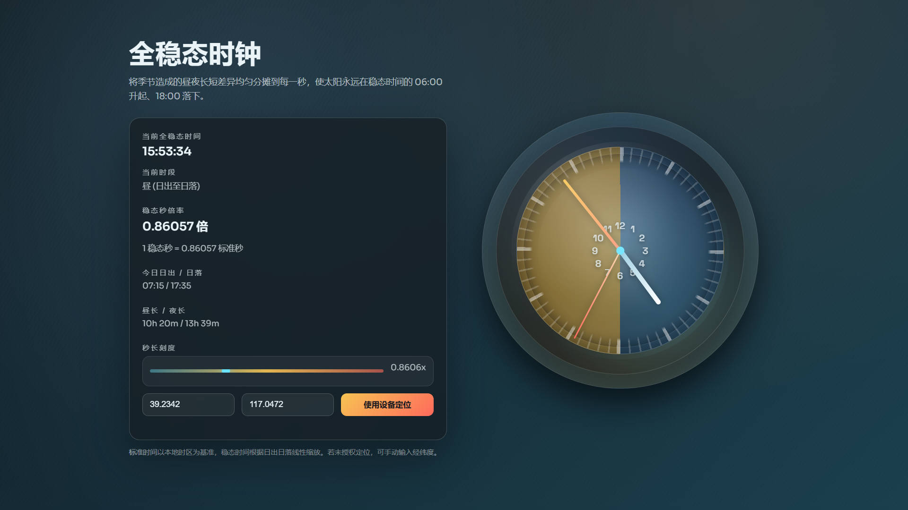

# 全稳态时钟

一个基于前端的「全稳态时间」模拟时钟。它保证每天稳态时间的 06:00 为日出、18:00 为日落，并将季节导致的昼夜长短差异均匀分摊到每一秒中，因此冬天与夏天的“稳态秒”长度不同。

## 功能
- 稳态指针钟（时针/分针/秒针）
- 稳态数字时间显示
- 当前稳态秒倍率（1 稳态秒 = x 标准秒）
- 今日日出/日落与昼夜时长
- 经纬度输入 + 设备定位

## 原理简述
- 先用近似太阳位置公式计算日出/日落时间（基于当前日期与经纬度）。
- 白天区间线性映射到稳态 06:00–18:00，夜晚区间线性映射到稳态 18:00–次日 06:00。
- 稳态秒倍率 = 当前区间长度 / 12 小时。

## 使用方式
1. 直接用浏览器打开 `index.html`。
2. 输入经纬度，或点击“使用设备定位”。
3. 即可看到稳态时间、倍率与日出日落等信息。

## 注意事项
- 日出日落为近似计算，足够用于视觉与概念演示。
- 若输入高纬度导致极昼/极夜，系统会提示并退化为标准时间显示。
- 默认经纬度为纽约（40.7128, -74.0060），可自行修改。

## 文件结构
- `index.html`：单页应用，包含样式与逻辑

## 可选改动
- 若希望默认展示某城市，可修改 `DEFAULT_LOCATION`。
- 可微调 `.numbers` 中 `--radius` 改变数字刻度位置。
